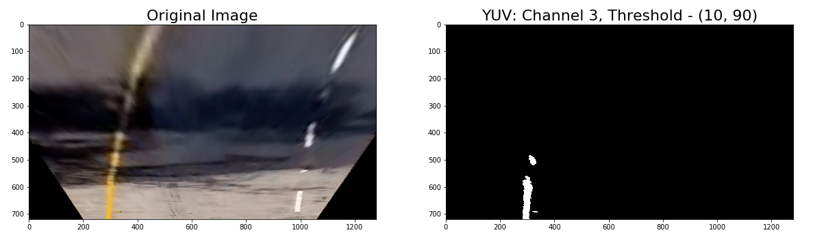

# Self-Driving Car Engineer Nanodegree Program
## Advanced Lane Finding Project

The goals / steps of this project are the following:

* Compute the camera calibration matrix and distortion coefficients given a set of chessboard images.
* Apply a distortion correction to raw images.
* Use color transforms, gradients, etc., to create a thresholded binary image.
* Apply a perspective transform to rectify binary image ("birds-eye view").
* Detect lane pixels and fit to find the lane boundary.
* Determine the curvature of the lane and vehicle position with respect to center.
* Warp the detected lane boundaries back onto the original image.
* Output visual display of the lane boundaries and numerical estimation of lane curvature and vehicle position.


[//]: # (Image References)

[im01](output_images/01-all_chessboards.png "Chessboards")
[im02](output_images/02-corners_found.png "Chessboard Corners")
[im03](output_images/03-undistorted_image.png "Undistorted Chessboard")
[im04](output_images/04-warped_image.png "Warped Image")
[im05](output_images/05-sobel-x.png "SobelX Threshold")
[im06](output_images/06-sobel-mag.png "Sobel Mag")
[im07](output_images/07-hls_lchannel.png "HLS, L-Channel")
[im08](output_images/08-yuv_vchannel.png "YUV, V-Channel")
[im09](output_images/09-lab_bchannel.png "LAB, B-Channel")
[im10](output_images/10-blend_thresh_1.png "Blended Threshold, Ex.1")
[im11](output_images/11-blend_thresh_2.png "Blended Threshold, Ex.2")
[im12](output_images/12-blend_thresh_3.png "Blended Threshold, Ex.3")
[im13](output_images/13-blend_thresh_4.png "Blended Threshold, Ex.4")
[im14](output_images/14-thresh_histogram.png "Box-Fit Histogram")
[im15](output_images/15-box_search1.png "Box-Fit Output ex1")
[im16](output_images/16-box_search2.png "Box-Fit Output ex2")
[im17](output_images/17-box_search3.png "Box-Fit Output ex3")
[im18](output_images/18-curve_search1.png "Curve-Fit Output ex1")
[im19](output_images/19-curve_search2.png "Curve-Fit Output ex2")
[im20](output_images/20-final_output.png "Final Output")
[final](output_images/final.gif "Final Output")

### Camera Calibration

#### 1. Briefly state how you computed the camera matrix and distortion coefficients. Provide an example of a distortion corrected calibration image.

The code corresponding to the Camera Calibration process is contained in cells 2-9. 

In order to calculate the camera matrix and distortion coefficients, the OpenCV functions `findChessboardCorners` and `calibrateCamera` are used. First, I took a look at all the chessboard images which were provided to count the number of corners for the function to look for along the vertical and horizontal axes.


Although all corners werent visible in all images, using 9x6 as an input allowed a sufficient number of images to be processed to move ahead. If more images were kicked out, or if I wanted to make sure that all imaged were processed, I could have looped through different combinations of x/y corners to make sure everything was captured.


### Pipeline (single images)
---
#### 1. Provide an example of a distortion-corrected image.

Below, you can see the result of the camera calibration process on the undistorted chessboard on the right. The difference is more easily seen on side-by-side chessboard images vs. the car dashcam images.


#### 2. Describe how (and identify where in your code) you performed a perspective transform and provide an example of a transformed image.

Lines 9-15

I chose to first warp the image from 'driver-view' to 'bird's-eye view', because it had the effect of cropping out areas of the image that are not relevant to the lane-finding exercise. 

Cells corresponding to the perspective transform process are cells 9-15. In the `warp_img` function, I use the OpenCV functions `getPerspectiveTransform` and `warpPerspective` to both warp an input image to bird's-eye view, and unwarp a bird's-eye view image to driver-view with the `revert` flag.

The inputs required to compute the transform matrix are `(src)` points and `(dst)` points. I decided to hard code these, as the camera is fixed on the car, and therefore lanes should generally stay within a fixed region.

I selected `(src)` points to line up with the lane lines, and go from just under the horizon, to just above the hood of the car. By doing this, I was able to crop out some unnecessary noise at the top and bottom of each image. `(dst)` points were set as a fraction of the image dimensions: orient the left lane 1/4 the way in from the left, and the right lane 1/4 the way in from the right.


```
src = np.float32([[275,img.shape[0]-50],
                  [595,450], 
                  [685,450], 
                  [1030,img.shape[0]-50]])
dst = np.float32([[img.shape[1]//4,img.shape[0]],
                  [img.shape[1]//4,0],
                  [img.shape[1]//4*3,0],
                  [img.shape[1]//4*3,img.shape[0]]])
```

#### 3. Describe how (and identify where in your code) you used color transforms, gradients or other methods to create a thresholded binary image.  Provide an example of a binary image result.

When I was comfortable with the image warp function, I moved on to the thresholding step. In cell 18, I defined functions for a number of thresholding approaches (listed below), and in the subsequent cells experimented with a number of different combinations of input parameters to see what worked best across a range of images to isolate different parts of the lane.

**Thresholding Approaches:**
*Gradient Thresholds*
Sobel Gradient - x/y dimensions
Magnitude of Sobel Gradient
Direction of Sobel Gradient

*Color Thresholds*
HLS Threshold
HSV Threshold
YUV Threshold
LAB Threshold


After experimenting with a number of different thresholding levels of each, I decided to combine the following into a blended threshold.

**Method**|**Channel**|**Threshold**|
--- |: --- :| --- :|
Sobel Gradient | x-Dim | (20,100)|
Sobel Magnitude | *n/a* | (20,50)|
HLS Threshold | L-Channel | (210,255)|
YUV Threshold | V-Channel | (10,90)|
LAB Threshold | B-Channel | (50,150)|


The Sobel Threshold along the x-dimension does a good job of picking up lane lines, but can be noisy.


With the Sobel Magnitude, I set a large kernel, which seemed to add some thickness to the lines picked up by the SobelX Threshold.


By thresholding the 'L' channel (Lightness) of the HLS color convention above 210, it looks like it is picking up the white lines. 



The low-end of the YUV V-Channel looks like it picked up the yellow line.


The 'B-Channel' of the LAB color convention seems to pick up the yellow line as well, but in black instead of white. Because of this, when I aggregate this into a blended filter, I include '0' pixels (black) rather than '1' pixels (white).

In cell 26, I define the `blend_thresh` function, which combines the above filters into an aggregate wrapper. Below are 4 examples of the `blend_thresh` function applied to sample images.


#### 4. Describe how (and identify where in your code) you identified lane-line pixels and fit their positions with a polynomial?

After creating the pipeline to output binary thresholded images, the next step is to isolate lane line image pixels and use these datapoints to fit a polynomial. To do this, I wrote two functions: `box_fit` (cell 30), and `curve_fit` (cell 32). 

For box fit, we will establish starting points for left/right lanes by looking for peaks in the left/right portion of an image histogram, and drawing a box around the left/right starting points. We will then iterate through the image, drawing boxes around pixel clusters, and fit a polynomial function to the points contained in these boxes using the Numpy `polyfit()` function. 

Box fit is used when no polynomial function coefficients exist (first frame of video) or when polynomial coefficients are stale (line fit data has been rejected for a certain number of frames).


Below are a number of output samples of the `box_fit` function, which illustrate 
the process.


`Curve-fit` works in a similar way as `box_fit`, except instead of bootstrapping through the image, it uses the polynomial fit of previous frames to set the search area. All pixels within a certain margin of the fit line (set to 100 in the function) are designated line pixels. These line pixels are fed back into the Numpy `polyfit()` function to fit the data. Below are two examples of the `curve-fit` output.


#### 5. Describe how (and identify where in your code) you calculated the radius of curvature of the lane and the position of the vehicle with respect to center.

The calculation of radius of curvature is based on [this website](http://www.intmath.com/applications-differentiation/8-radius-curvature.php). The calculation of radius of curvature and vehicle offset from center are performed in the `orientation` function in cell 34.

The formula for radius of curvature is as follows:
```
curve_radius = ((1 + (2*lt_fit_cr[0]*ploty*yft_per_pix + lt_fit_cr[1])**2)**1.5) / np.absolute(2*lt_fit_cr[0])
```                      
where `lt_fit_cr[0]` is the first polyfit coefficient (y-squared coefficient) of the second order polynomial, and `lt_fit_cr[1]` is the second coefficient (y).

Left and right lane polynomial coefficients are fed into this function, which are used to calculate (x,y) coordinates for the curves in pixel space. The x/y pixels are multiplied by the relevant pixel-space/real-space conversion values, which are then used to calculate new polynomial coordinates with `polyfit()`. These 'real-space' coefficients are the `lt_fit_cr` and `rt_fit_cr` coefficients used for radius curvature calculations.

`ploty` is an array of points along the y-axis used to plot the corresponding fitted x-values. By feeding `ploty` into the function, the output of the function is an array of all curve radii for each point along the y-axis. I averaged this to arrive at a smoothed number for each lane. The assumption is that the radius of curvature should be roughly the same across the curve. In addition, I considered using the variance of curvature within a frame as a filter for kicking out bad data.

The position of the car relative to center was calculated as follows. Given that the camera is mounted on the center of the car, the midpoint of the x-axis is assumed to be the centerpoint of the car. To calculate the midpoint of the lane, we subtract the right-lane curve position from the left-lane curve position at the bottom of the image (y-max), which yields the lane width. We add half this value to the left-lane pixel position to get the lane midpoint pixel position. Subtracting the image midpoint from the lane midpoint, we get the car offset in pixel units. Multiplying this by the conversion factor gives us the offset in real-space units (in this case, feet).

#### 6. Provide an example image of your result plotted back down onto the road such that the lane area is identified clearly.

With all these functions finalized, I aggregated everything into the `final_output` function in cell 36, which yields the final output image below.


The last step I took before processing the video was to build a `Lane` class to log datapoints, smooth the output, and add a few layers of validation checks in case the model has problems finding the line. 

On the curve fitting, I averaged coefficients over the previous 10 frames to smooth the lane when plotted on the road. The same was done for the radius and offset calculations. In addition, the curvature data of left and right lanes were averaged to display a blended aggregate figure. 

The two validation filters that I included related to lane width and difference in left/right lane curvature. If the lane width (average of the whole image, not just one point) or the left/right lane curvatures were outside a specified band, the `error_count` would be incremented by 1. If the `error_count` exceeded 5, the line fit function reverted from `curve_fit` to `box_fit`.

---

### Pipeline (video)
___

#### 1. Provide a link to your final video output.  Your pipeline should perform reasonably well on the entire project video (wobbly lines are ok but no catastrophic failures that would cause the car to drive off the road!).

[](https://youtu.be/Kf1KX540M6M)

Here's a [link to my video result](./output_videos/project_video_processed.mp4), or click the image above!

### Discussion

#### 1. Briefly discuss any problems / issues you faced in your implementation of this project.  Where will your pipeline likely fail?  What could you do to make it more robust?


While I was able to achieve a good result on the test video, the challenge videos were much more problematic. In the `Lane` class and `process_video` function, I included mechanisms to log a lot of data that I could use for building validation filter layers. I also saved all the images where the `error_count` exceeded 5. 

Looking at the plots of all the logged data gave me a number of ideas of how I could structure the error-checking. However, looking at the saved problematic images, it was clear that the real problem was with setting the thresholding parameters. 

I intend to continue working on this thresholding problem until I can get both challenge videos to work. I think that what will ultimately work will be to have thresholding layers that can perform some brightness regularization to address problems with shadows, and then filters specifically for yellow lane lines and white lane lines. I have also read about some dynamic thresholding approaches that are a bit more involved, but which are ultimately likely to be more robust to a number of road conditions.

Another approach which might help would be to use a polynomial fitting function which reduces the impact of outliers when fitting the curve. Still, relative to cleaning up the binary thresholded image, I think this would come in a distant second.
